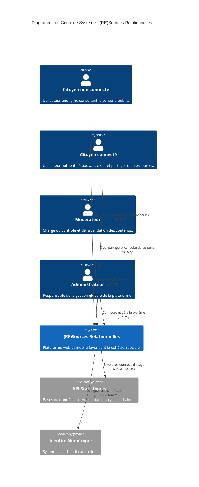

# Mon Architecture

Voici le diagramme de contexte du projet :

```mermaid
C4Context
  title Diagramme de Contexte Système - (RE)Sources Relationnelles

  %% --- Acteurs (Person) ---
  Person(citoyen_visiteur, "Citoyen non connecté", "Utilisateur anonyme consultant le contenu public.")
  Person(citoyen_membre, "Citoyen connecté", "Utilisateur authentifié pouvant créer et partager des ressources.")
  Person(moderateur, "Modérateur", "Chargé du contrôle et de la validation des contenus.")
  Person(admin, "Administrateur", "Responsable de la gestion globale de la plateforme.")

  %% --- Système Principal (System) ---
  System(systeme_re, "(RE)Sources Relationnelles", "Plateforme web et mobile favorisant la cohésion sociale.")

  %% --- Systèmes Externes (System_Ext) ---
  System_Ext(api_stats, "API Statistiques", "Bases de données externes pour l'analyse statistique.")
  System_Ext(auth_system, "Identité Numérique", "Système d'authentification tiers.")

  %% --- Relations (Rel) ---
  %% Citoyens
  Rel(citoyen_visiteur, systeme_re, "Consulte les ressources (lecture seule)", "HTTPS")
  Rel(citoyen_membre, systeme_re, "Crée, partage et consulte du contenu", "HTTPS")

  %% Staff
  Rel(moderateur, systeme_re, "Valide les publications", "HTTPS")
  Rel(admin, systeme_re, "Configure et gère le système", "HTTPS")

  %% Systèmes Externes
  Rel(systeme_re, api_stats, "Envoie les données d'usage", "API REST/JSON")
  Rel(systeme_re, auth_system, "Délègue l'authentification", "OIDC / OAuth2")
```